# 💣 Minesweeper

A lightweight Minesweeper-style game where the board is **encrypted and stored on-chain** using **Zama’s FHEVM**.  
Bomb locations are hidden cryptographically, but the game itself runs smoothly in the browser — just like classic Minesweeper.

This project serves as a **clean and minimal example** of how to use **Fully Homomorphic Encryption (FHE)** inside smart contracts without requiring cryptography expertise.

<p align="center">
  
</p>

---

* 🎮 Play → [minesweeper-zama.vercel.app](https://minesweeper-zama.vercel.app/)
* 📜 Contract → [Sepolia Explorer](https://sepolia.etherscan.io/address/0x41fA32DF0eC279a134f36B4F88ad773D16f92DCC)


## 🎮 Gameplay

1. Click the **😊 face button** to start a new game.
2. The board (bomb placement) is generated locally.
3. The board is encrypted and uploaded to the contract.
4. Play Minesweeper normally:

| Action | Input |
|-------|------|
| Open tile | **Left click** |
| Place/Remove flag | **Right click** |
| Restart | Click **😊** again |

### Winning / Losing

- Open all safe tiles → **🎉 You win**
- Click a bomb → **💥 Game over**

---

## 🧱 Tech Stack

| Layer | Tools |
|------|-------|
| Smart Contract | Solidity + FHEVM |
| Frontend | React + TypeScript |
| Wallet | Any EVM Wallet |
| Network | Sepolia Testnet |

---

## 🚀 Setup Instructions

### 1) Deploy Contract

```bash
cd contract
npm install
npx hardhat vars set PRIVATE_KEY   # set your wallet key
npm run build:test
npm run deploy:sepolia
```

Once deployed, the script automatically updates:


2) Run Frontend

```bash
cd frontend
npm install
npm run dev
```
Open in browser:

`
http://localhost:5173
`

🕹 Game Flow (Simplified)

```mermaid
graph TD;
A[Start Game] --> B[Generate Local Board]
B --> C[Encrypt Board + Store On-chain]
C --> D[Player Opens Tile]
D -->|Bomb| E[💥 Game Over]
D -->|Safe| F[Continue]
F -->|No Safe Tiles Left| G[🎉 Win]
```


📝 Notes

Bomb layout is generated client-side, for instant gameplay.

The encrypted board is stored on-chain, so no participant (including the contract or miners) can see bomb placement.

Tile revealing is handled locally, ensuring fast and smooth experience.

This design demonstrates the core FHE principle without involving verification proofs.


📚 Resources
FHEVM Docs → https://docs.zama.ai/fhevm